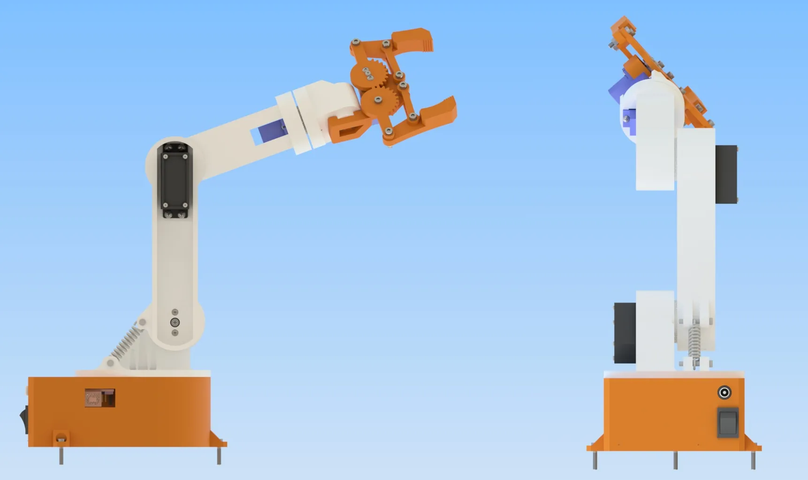
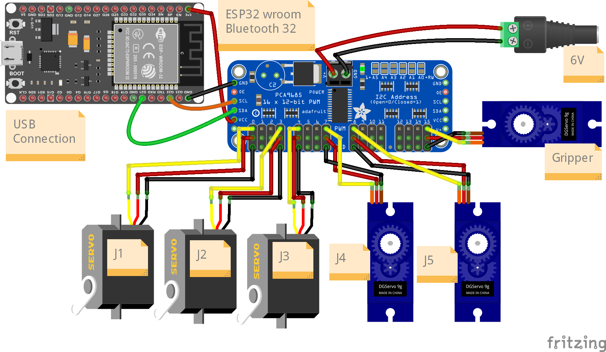
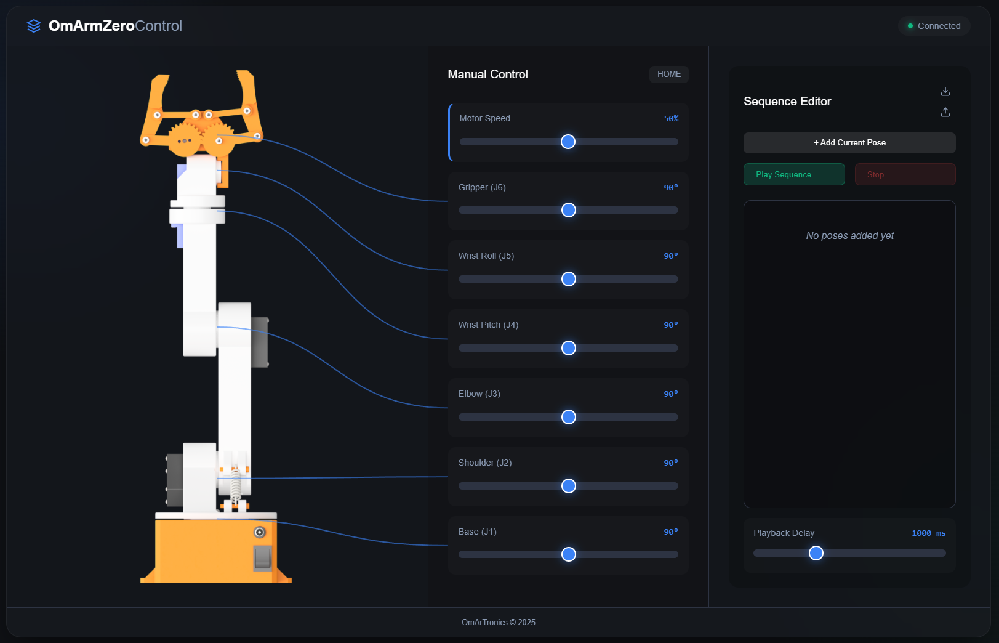

# OmArm Zero

**6-DOF (5+1 Gripper) 3D-Printed Robotic Arm with ESP32 WiFi Web Control**



[](LICENSE)
[](https://www.espressif.com/en/products/socs/esp32)
[](https://www.arduino.cc/en/software)

---

## Overview

OmArm Zero is a fully 3D-printed robotic arm with 6 degrees of freedom (5 arm joints + 1 gripper), controlled wirelessly over WiFi from any phone or laptop browser — no app required.

Connect to the ESP32's WiFi network, open `10.10.10.1` in any browser, and move the arm with sliders. Total cost: under $50.

## Specifications

| Parameter | Value |
|-----------|-------|
| Degrees of Freedom | 6 (5 arm joints + 1 gripper) |
| Maximum Reach | 303 mm |
| Rated Payload | 141 g (150 g max) |
| Servos | 3x MG996R (metal gear) + 3x SG90 |
| Controller | ESP32 DevKit V1 |
| PWM Driver | PCA9685 16-channel (I2C) |
| Power | 5V 10A DC supply |
| WiFi | Access Point mode (no router needed) |
| Web Interface | Browser-based GUI with PWA support |
| Serial Interface | 115200 baud (ROS 2 compatible) |
| Total BOM Cost | ~$48 |

## Repository Structure

```
OmArm-Zero/
├── firmware/
│   ├── OmArmZeroControl/       # Main WiFi web control firmware
│   ├── OmArmZero_LittleFS/     # LittleFS uploader + web interface
│   │   └── data/               # HTML, CSS, JS served from ESP32 flash
│   ├── ros2_serial/            # Serial firmware for ROS 2 integration
│   └── test/
│       ├── I2C_Scanner/        # I2C device scanner (debug)
│       └── Calibration_SendToHome/  # Home position calibration (0°)
├── electronics/
│   ├── wiring-diagram.png      # Fritzing breadboard view
│   ├── omarm-zero.fzz          # Fritzing source file
│   └── bom.html                # Bill of Materials
├── images/                     # Documentation images
├── LICENSE                     # MIT License
└── README.md
```

## Quick Start

### 1. Hardware Required

| # | Component | Qty |
|---|-----------|-----|
| 1 | ESP32 DevKit V1 (30-pin) | 1 |
| 2 | PCA9685 16-Channel PWM Servo Driver | 1 |
| 3 | MG996R Servo Motor (metal gear) | 3 |
| 4 | SG90 Micro Servo | 3 |
| 5 | 5V 10A DC Power Supply | 1 |
| 6 | 686ZZ Bearing (6x13x5 mm) | 1 |
| 7 | Extension Spring (4 mm OD, 15 mm) | 1 |
| 8 | M3, M1.6, No.2, No.3 screws | assorted |

### 2. Wiring



| PCA9685 Channel | Joint | Servo |
|-----------------|-------|-------|
| 0 | J1 — Base rotation | MG996R |
| 1 | J2 — Shoulder | MG996R |
| 2 | J3 — Elbow | MG996R |
| 3 | J4 — Wrist pitch | SG90 |
| 4 | J5 — Wrist roll | SG90 |
| 5 | J6 — Gripper | SG90 |

**I2C connections:** PCA9685 SDA → GPIO 21, SCL → GPIO 22, Address: 0x40

**Power:** Connect the 5V 10A supply directly to the PCA9685 V+ terminal. Do NOT power servos from ESP32.

### 3. Flash Firmware

**Prerequisites:**
- Arduino IDE 2.x
- ESP32 board package (Espressif Systems)
- Libraries: `Adafruit_PWMServoDriver`, `Wire`, `WiFi`, `WebServer`, `LittleFS`

**Step 1 — Upload web interface to LittleFS:**

1. Install the [ESP32 LittleFS Upload Plugin](https://github.com/lorol/arduino-esp32littlefs-plugin)
2. Open `firmware/OmArmZero_LittleFS/OmArmZero_LittleFS.ino`
3. Use **Tools → ESP32 Sketch Data Upload** to flash the `data/` folder
4. Or: upload the sketch itself which creates the files programmatically

**Step 2 — Upload main firmware:**

1. Open `firmware/OmArmZeroControl/OmArmZeroControl.ino`
2. Select board: **ESP32 Dev Module**
3. Upload

### 4. Connect and Control

1. Power on the arm (5V supply + USB to ESP32)
2. Connect your phone/laptop to WiFi network: **OmArmZero**
3. Open browser: **http://10.10.10.1**
4. Move sliders to control each joint



## Web Interface Features

- 6 individual joint sliders with real-time control
- Sequence recorder — save and replay motion sequences
- Home button — return all joints to 0° position
- PWA support — add to home screen for app-like experience
- Responsive design — works on mobile and desktop
- No internet required — runs entirely on ESP32's local network

## ROS 2 Integration

For ROS 2 Jazzy integration, flash `firmware/ros2_serial/omarm_zero_ros2_serial.ino` instead. This provides a serial protocol (115200 baud) compatible with the `ros2_control` hardware interface.

Serial command format: `J<joint_id>:<angle>\n` (e.g., `J1:90\n`)

## Calibration

Before first use, flash `firmware/test/Calibration_SendToHome/Calibration_SendToHome.ino` to set all servos to the 0° home position. Assemble the arm with all joints at 0°.

## Troubleshooting

| Issue | Solution |
|-------|----------|
| PCA9685 not found | Run `firmware/test/I2C_Scanner/` to check I2C address |
| Servos jitter | Ensure dedicated 5V 10A supply, not USB power |
| WiFi won't connect | Default SSID: `OmArmZero`, no password |
| Web page won't load | Verify LittleFS upload succeeded (Step 1) |

## 3D Print Files

STL files, STEP source, and the full 70-page PDF build guide are available as a complete package:

- **Cults3D:** [OmArm Zero — Complete Package](https://cults3d.com/en/3d-model/gadget/omarm-zero-6-dof-5-1-gripper-robotic-arm-esp32-wifi-control-stl-step)
- **OmArTronics Shop:** [Project Package](https://omartronics.com/product/omarm-zero-6dof-esp32-robotic-arm/)

## Links

- [Full Build Guide (Blog)](https://omartronics.com/omarm-zero-build-5-dof-robotic-arm-esp32-web-control/)
- [YouTube Build Video](https://youtu.be/smRG6uzNHag)
- [OmArTronics Website](https://omartronics.com/)

## License

This firmware is released under the **MIT License** — see [LICENSE](LICENSE).

**Note:** The 3D-printable CAD files (STL, STEP) and the PDF build guide are sold separately and are for personal, non-commercial use only. This repository contains only the firmware and web interface source code.

## Author

[OmArTronics](https://omartronics.com)
